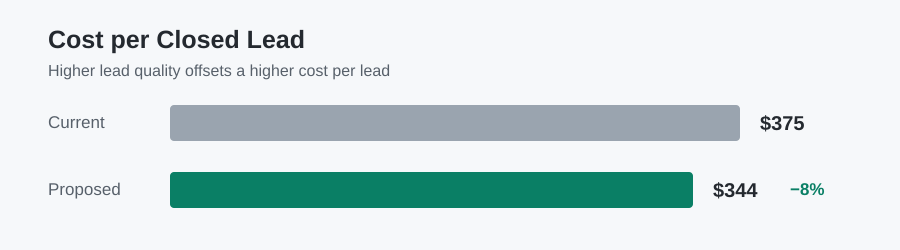
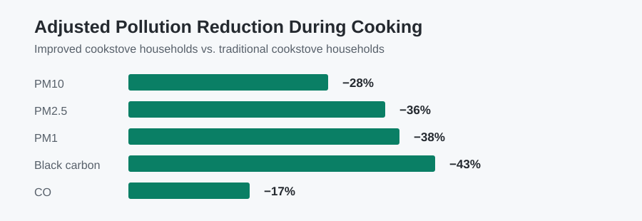
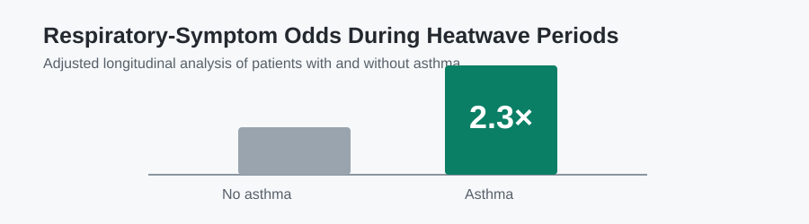
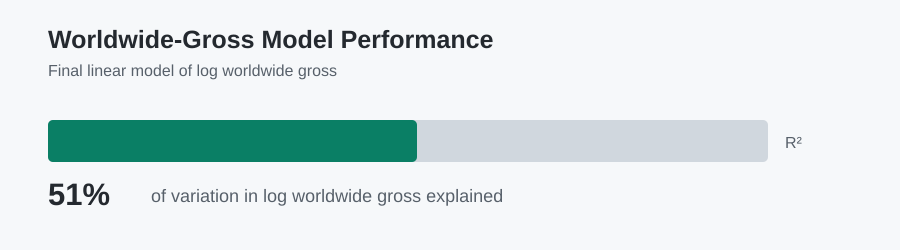

# Ka Wai Sit

### Data Analyst · Statistical & Business Analytics

**SQL · Python · R · Statistical Modeling**

M.S. Biostatistics, UC San Diego &nbsp;|&nbsp; B.S. Statistics, UC Davis

[Featured Projects](#featured-analytics-projects)

**Question → Clean & Validate → Analyze → Model → Visualize → Recommend**

---

## About Me

Data Analyst with experience across gaming analytics and public-health research. I use SQL, Python, R, and statistical modeling to work through complex datasets, identify actionable patterns, and support business and research decisions.

My work combines the practical discipline of analytics—defining a decision, validating messy data, and communicating a recommendation—with rigorous applied statistics. I am especially interested in roles where data can guide operational, policy, or research decisions.

## Professional Snapshot

- **UC San Diego — Research Data Analyst:** Led statistical analysis across public-health research involving environmental exposure, clinical screening, and longitudinal health data.
- **Galaxy Entertainment — TG Analysis Analyst:** Analyzed millions of gaming transactions with SQL and R for customer segmentation, revenue KPI reporting, workforce planning, pricing, and revenue analysis.
- **Research:** Contributed to published and submitted research and presented two projects at the ACE Annual Meeting.

## Featured Analytics Projects

### 01 — [Lead Quality Optimization](https://github.com/ksitcode00/lead-quality-optimization)

**Context:** Interview-style marketing analytics challenge

**Business problem:** Could a marketing team raise cost per lead from **$30 to $33** if lead quality improves from **8.0% to 9.6%**?

**Finding:** After evaluating lead-quality trends and segment-level drivers, the proposed scenario reduced estimated cost per closed lead from **$375 to about $344**.

**Recommendation:** Manage toward closed rate and cost per closed lead; reallocate from weak partner/creative mixes, test stronger formats, and validate changes through controlled rollout.

**My role:** Completed the end-to-end Python analysis, including data validation, trend and segment analysis, adjusted logistic regression, scenario modeling, and executive recommendations.

`Python` · `pandas` · `Logistic Regression` · `KPI Analysis` · `Scenario Analysis`

[Project README](https://github.com/ksitcode00/lead-quality-optimization) · [Analysis Notebook](https://github.com/ksitcode00/lead-quality-optimization/blob/main/notebooks/lead_quality_analysis.ipynb) · [Key Figures](https://github.com/ksitcode00/lead-quality-optimization/tree/main/figures) · [Methodology](https://github.com/ksitcode00/lead-quality-optimization/blob/main/docs/methodology.md)

---

### 02 — [Household Air Pollution Analysis](https://github.com/ksitcode00/household-air-pollution-analysis)

**Context:** UC San Diego environmental-health research | 180 households

**Research question:** Were improved-cookstove households associated with lower indoor air pollution after accounting for household and program factors?

**Finding:** In adjusted models, improved-cookstove use was associated with **28% lower PM10**, **36% lower PM2.5**, and **38% lower PM1** during cooking periods.

**Program implication:** Cleaner-stove programs may have their clearest benefit during active cooking, while electricity access, kitchen setting, and household conditions still shape real-world exposure.

**My role:** Led statistical analysis in R, including data cleaning, adjusted regression models, causal-inference sensitivity analysis, diagnostics, and interpretation for manuscript development.

`R` · `Regression Modeling` · `Environmental Health` · `Mediation` · `Causal-Inference Sensitivity Analysis`

[Project Overview](https://github.com/ksitcode00/household-air-pollution-analysis) · [R Analysis](https://github.com/ksitcode00/household-air-pollution-analysis/blob/main/analysis/air_pollution_analysis.Rmd) · [Methods](https://github.com/ksitcode00/household-air-pollution-analysis/blob/main/docs/methodology.md) · [Data Privacy](https://github.com/ksitcode00/household-air-pollution-analysis/blob/main/docs/data_privacy.md)

---

### 03 — [Longitudinal Health Analysis](https://github.com/ksitcode00/longitudinal-health-analysis)

**Context:** UC San Diego longitudinal public-health research | 660 participants

**Research question:** How did self-reported health impacts and symptoms change across three survey phases, and which groups appeared most vulnerable?

**Finding:** Patients with asthma had approximately **2.3× higher odds of respiratory symptoms** during heatwave periods; reported impacts generally declined across later study phases.

**Risk implication:** Free-text symptom cleaning, repeated-measures modeling, and targeted risk communication can help identify groups that may benefit from symptom surveillance and support.

**My role:** Conducted longitudinal statistical analysis in R, including symptom-data cleaning, repeated-measures restructuring, GEE and mixed-effects modeling, diagnostics, and interpretation.

`R` · `GEE` · `GLMM` · `Longitudinal Analysis` · `Health-Survey Data`

[Project Overview](https://github.com/ksitcode00/longitudinal-health-analysis) · [R Analysis](https://github.com/ksitcode00/longitudinal-health-analysis/blob/main/analysis/longitudinal_health_analysis.Rmd) · [Figures](https://github.com/ksitcode00/longitudinal-health-analysis/tree/main/figures) · [Methods](https://github.com/ksitcode00/longitudinal-health-analysis/blob/main/docs/methodology.md) · [Data Privacy](https://github.com/ksitcode00/longitudinal-health-analysis/blob/main/docs/data_privacy.md)

---

### 04 — [Movie Success Analysis](https://github.com/ksitcode00/movie-success-analysis)

**Context:** UC Davis data science project | 933-row final modeling dataset

**Question:** Which production and audience factors help explain movie ratings and worldwide box-office performance?

**Finding:** The final worldwide-gross model explained about **51%** of variation in log gross. Budget, audience rating, franchise status, and critic score were among the most informative factors.

**What it demonstrates:** Collected, cleaned, and matched data across public web sources; engineered features and applied logistic and linear regression with diagnostic checks.

**My role:** Built the Python data-collection, entity-matching, feature-engineering, modeling, diagnostic, and interpretation workflow.

`Python` · `Web Scraping` · `Entity Matching` · `Feature Engineering` · `Regression Diagnostics`

[Project Overview](https://github.com/ksitcode00/movie-success-analysis) · [Notebook](https://github.com/ksitcode00/movie-success-analysis/blob/main/notebooks/movie_success_analysis.ipynb) · [Figures](https://github.com/ksitcode00/movie-success-analysis/tree/main/figures) · [Results Summary](https://github.com/ksitcode00/movie-success-analysis/blob/main/docs/results_summary.md) · [Data Dictionary](https://github.com/ksitcode00/movie-success-analysis/blob/main/docs/data_dictionary.md)

## Selected Research & Publications

- **Heat and Dust Impacts on the Health of Refugees in Zaatari Refugee Camp** — Co-author · *GeoHealth* (2026) · [Paper](https://pubmed.ncbi.nlm.nih.gov/42524033/) · [DOI](https://doi.org/10.1029/2025GH001687)
- **Determinants of Concentrations of Indoor Pollutants in Homes in Rural India** — Co-author · submitted to *Indoor Air*
- **EyeMobile Clinic for Detection and Prevention of Eye Diseases in Uninsured Minorities** — Co-author · submitted manuscript
- **ACE Annual Meeting 2025** — Poster presenter for research on improved cookstoves and eye-disease screening

## Additional Technical Work

- [Statistical Learning: Classification & Model Selection](https://github.com/ksitcode00/statistical-learning-classification) — R implementations of logistic regression, LDA, SVM, trees, random forests, and cross-validation.

## Technical Skills

| Area | Tools & methods |
| --- | --- |
| **Programming & analytics** | SQL, Python, R, Excel, `pandas`, tidyverse, data cleaning, EDA, reporting |
| **Statistical analysis** | Regression, logistic regression, longitudinal analysis, GEE, mixed-effects models, causal-inference sensitivity analysis, A/B testing |
| **Decision support** | KPI analysis, segmentation, scenario analysis, data visualization, research communication |

Open to Data Analyst and Research Analyst opportunities.

